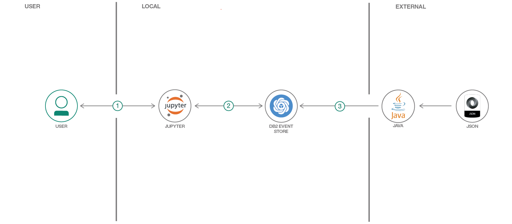
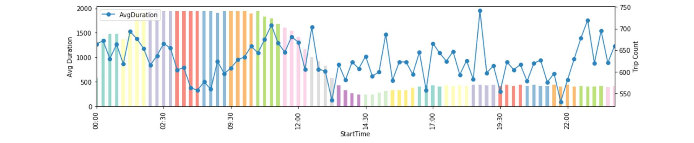

[](https://travis-ci.org/IBM/db2-event-store-taxi-trips)

# Analyze event streams with taxi cab data

In this code pattern, we will stream data from a Java program and use a Jupyter notebook to
demonstrate charting of statistics based on historical and live events. IBM Db2 Event Store
is used as the event database.

IBM® Db2 Event Store (formerly IBM Project EventStore) is an in-memory database designed for massive structured data volumes and real-time analytics built on Apache SPARK and Apache Parquet Data Format. The solution is optimized for event-driven data processing and analysis. It can support emerging applications that are driven by events such as IoT solutions, payments, logistics and web commerce. It is flexible, scalable and can adapt quickly to your changing business needs over time. Available in a free developer edition and an enterprise edition that you can download now. The enterprise edition is free for pre-production and test.

Credit goes to Jacques Roy for the original Java code and Jupyter notebook.

When the reader has completed this code pattern, they will understand how to:

* Install IBM Db2 Event Store developer edition
* Interact with Db2 Event Store using Python and a Jupyter notebook
* Use a Java program to insert into IBM Db2 Event Store
* Query the database and chart statistics while events are processed



## Flow

1. User runs Jupyter notebook
2. Notebook connects to Db2 Event Store to analyze live event stream
3. External Java program sends live events

## Included components

* [IBM Db2 Event Store](https://www.ibm.com/products/db2-event-store): In-memory database optimized for event-driven data processing and analysis.
* [IBM Watson Studio](https://www.ibm.com/cloud/watson-studio): Analyze data using RStudio, Jupyter, and Python in a configured, collaborative environment that includes IBM value-adds, such as managed Spark.
* [Jupyter Notebook](https://jupyter.org/): An open source web application that allows you to create and share documents that contain live code, equations, visualizations, and explanatory text.
* [Python](https://www.python.org/): Python is a programming language that lets you work more quickly and integrate your systems more effectively.
* [Java](https://java.com/): A secure, object-oriented programming language for creating applications.

## Featured technologies

* [Databases](https://en.wikipedia.org/wiki/Database): Repository for storing and managing collections of data.
* [Analytics](https://developer.ibm.com/technologies/analytics/): Analytics delivers the value of data for the enterprise.
* [Data Science](https://medium.com/ibm-data-science-experience/): Systems and scientific methods to analyze structured and unstructured data in order to extract knowledge and insights.

# Watch the Video

[](https://www.youtube.com/watch?v=7R-Q3bxp2rI)

# Steps

## Run locally

1. [Install IBM Db2 Event Store Developer Edition](#1-install-ibm-db2-event-store-developer-edition)
1. [Clone the repo](#2-clone-the-repo)
1. [Build and run the Java event loader](#3-build-and-run-the-java-event-loader)
1. [Create the Jupyter notebook](#4-create-the-jupyter-notebook)
1. [Run the notebook](#5-run-the-notebook)

### 1. Install IBM Db2 Event Store Developer Edition

Install IBM® Db2® Event Store Developer Edition on Mac, Linux, or Windows by following the instructions [here.](https://www.ibm.com/support/knowledgecenter/en/SSGNPV_1.1.3/desktop/install.html)

> Note: This code pattern was developed with EventStore-DeveloperEdition 1.1.4

### 2. Clone the repo

Clone the `db2-event-store-taxi-trips` locally. In a terminal, run:

```bash
git clone https://github.com/IBM/db2-event-store-taxi-trips
```

### 3. Build and run the Java event loader

#### Pre-requisite

Maven >= 3.5 is used to build, test, and run. Check your maven version using the following command:

```bash
mvn -v
```

To download and install maven, refer to [maven.](https://maven.apache.org/download.cgi)

#### Download dependencies

Use maven to download the dependencies with the following commands:

```bash
cd db2-event-store-taxi-trips
mvn clean
mvn install
```

#### Compile and run the event loader daemon

The event loader runs as a daemon and waits for the notebook to tell it to start and stop
the event stream.

The args string contains `"port host user password"` matching the settings in the notebook.

```bash
mvn compile exec:java -Dexec.mainClass=com.ibm.developer.code.patterns.db2eventstoretaxitrips.StartLoader -Dexec.args="9292 0.0.0.0 admin password"
```

> Note: `mvn compile` can be done separately, but including it before `exec` gives you a recompile as needed if the code has changed.

#### Killing the daemon

Use `CTRL-C` to kill the event loader daemon when you are done with it.

### 4. Create the Jupyter notebook

> Note: Db2 Event Store is built with Watson Studio

The git repo includes a Jupyter notebook which demonstrates interacting with
Db2 Event Store with Spark SQL and matplotlib.

The notebook also demonstrates basics such as:

* Create a database
* Drop a database
* Create a table
* Query a table

#### Importing the notebook

Use the Db2 Event Store UI to create and run the notebook.

1. From the upper-left corner `☰` drop down menu, select `My Notebooks`.
1. Click on `add notebooks`.
1. Select the `From File` tab.
1. Provide a name.
1. Click `Choose File` and navigate to the `notebooks` directory in your cloned repo. Open the file `taxi_trips.ipynb`.
1. Scroll down and click on `Create Notebook`.

### 5. Run the notebook

1. Edit the `HOST` constant in the first code cell. You will need to enter your host's IP address here.
2. Run the notebook using the menu `Cell > Run all` or run the cells individually with the play button.

# Sample output

## Java event loader

The Java daemon waits until the notebook tells it to start loading events. When you run the notebook code after **3.3 Start the insertion program** the cell output will say `Insert process started` and the Java program output will begin (or restart) to print messages like these:

```bash
Number of records inserted: 400, total time: 286ms
Number of records inserted: 800, total time: 348ms
Number of records inserted: 1200, total time: 391ms
Number of records inserted: 1600, total time: 434ms
Number of records inserted: 2000, total time: 473ms
```

The provided JSON file has 50,000 events.  The loader continues until it runs out of events or until the final cell of the notebook signals for it to stop.

## Run SQL queries

### Count(*)

The first query to try is a simple `count(*)` query. Using the `show()` function you will see that you have successfully inserted and queried events. You can run this cell over and over to see the count increase.


### Group by time

The next query uses a **GROUP BY** to aggregate by time. With this query you will see the counts and average stats for each 15 minute interval. By running this repeatedly (the notebook includes a short query loop), you will see that as the events come in the latest time interval has a growing count and changing averages.


### Animated charting

Using the same aggregation query inside an animated matplotlib loop, we can watch as the time slices fill in with events. In this simple example, the last time slice shows a changing count and average as it responds to the events as they come in.



### Example notebook with output

If you didn't get to run it yourself, take a look at the notebook with output [here](examples/taxi_trips.ipynb).

# Links

* [**Ingest and Analyze Streaming Event Data at Scale with IBM Db2 EventStore**](https://www.ibmbigdatahub.com/blog/ingest-and-analyze-streaming-event-data-scale-ibm-eventstore)
* [**Fast Data Ingestion, ML Equates to Smarter Decisions Faster**](https://www.ibm.com/blogs/think/2018/03/db2-event-store/)
* [**IBM Db2 Event Store Solution Brief**](https://www-01.ibm.com/common/ssi/cgi-bin/ssialias?htmlfid=09014509USEN&)
* [**Overview of IBM Db2 Event Store Enterprise Edition**](https://www.ibm.com/support/knowledgecenter/en/SSGNPV_1.1.3/local/overview.html#overview)
* [**Developer Guide for IBM Db2 Event Store Client APIs**](https://www.ibm.com/support/knowledgecenter/en/SSGNPV_1.1.3/develop/dev-guide.html)
* [**IBM Marketplace**](https://www.ibm.com/products/db2-event-store)

# Learn more

* **Data Analytics Code Patterns**: Enjoyed this code pattern? Check out our other [data analytics code patterns](https://developer.ibm.com/technologies/analytics/)
* **AI and Data Code Pattern Playlist**: Bookmark our [playlist](https://www.youtube.com/playlist?list=PLzUbsvIyrNfknNewObx5N7uGZ5FKH0Fde) with all of our code pattern videos
* **IBM Watson Studio**: Master the art of data science with IBM's [Watson Studio](https://www.ibm.com/cloud/watson-studio)

# License

This code pattern is licensed under the Apache License, Version 2. Separate third-party code objects invoked within this code pattern are licensed by their respective providers pursuant to their own separate licenses. Contributions are subject to the [Developer Certificate of Origin, Version 1.1](https://developercertificate.org/) and the [Apache License, Version 2](https://www.apache.org/licenses/LICENSE-2.0.txt).

[Apache License FAQ](https://www.apache.org/foundation/license-faq.html#WhatDoesItMEAN)
